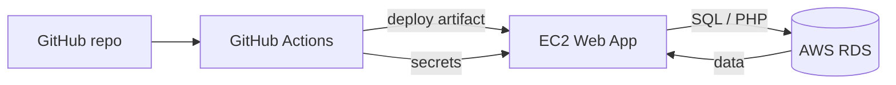

# Kako narediš slike, korak za korakom

Spodaj je točen postopek za vsako sliko. Ideja je preprosta: odpreš pravo stran, narediš dejanje, nato shraniš screenshot z imenom, ki je tukaj zapisano.

## 00) Kje hitro narišeš diagram
Najlažja spletna stran za kopiranje Mermaid kode:
- https://mermaid.live

Tam samo prilepiš kodo, na desni se samodejno izriše diagram, potem narediš screenshot.

## 0) Kam shrani slike
Priporočam mapo:
- `VelkovMichel/ProjektnaNaloga/slike/`

Če jo še nimaš, jo ustvari. Slike poimenuj tako:
- `01-arhitektura.png`
- `02-github-actions-success.png`
- `03-rds-settings.png`
- `04-ec2-deploy-success.png`
- `05-db-healthcheck.png`
- `06-rollback.png`

## 1) Slika arhitekture projekta
Ime datoteke: `01-arhitektura.png`

Kaj mora biti na sliki:
- GitHub repozitorij ali diagram,
- EC2,
- RDS,
- puščice med GitHub Actions -> EC2 -> RDS.

Kako narediš:
1. Odpri https://mermaid.live.
2. Prilepi to kodo:



3. Počakaj, da se diagram izriše na desni strani.
4. Naredi screenshot tako, da se vidita koda in izris.

Kam v poročilo:
- takoj za opisom projekta, pri razdelku `Opis projekta` ali `Izvedba`.

## 2) Slika uspešnega GitHub Actions runa
Ime datoteke: `02-github-actions-success.png`

Kaj mora biti na sliki:
- odprt GitHub Actions run,
- vidni jobi `test`, `package`, `deploy`,
- status `success`.

Kako narediš:
1. Odpri GitHub repo.
2. Pojdi na `Actions`.
3. Odpri zadnji uspešen run `deploy-ec2`.
4. Poskrbi, da se vidi celoten seznam jobov in zelen status.
5. Naredi screenshot.

Če želiš direktno povezavo do zadnjega uspešnega runa, uporabi:
- `https://github.com/almaVelkov2026/racunalnistvo-v-oblaku/actions`

Kam v poročilo:
- v razdelek o izvedbi, takoj po opisu pipeline-a.

## 3) Slika RDS nastavitve ali endpointa
Ime datoteke: `03-rds-settings.png`

Kaj mora biti na sliki:
- RDS instance details,
- endpoint,
- `Public access = No`.

Kako narediš:
1. Odpri AWS Console.
2. Pojdi v `RDS`.
3. Izberi tvojo RDS instanco.
4. Odpiraj zavihek `Connectivity & security` ali `Configuration`.
5. Poskrbi, da je viden endpoint in da je `Public access` nastavljen na `No`.
6. Naredi screenshot.

Če `Public access` v GUI ni lepo viden, uporabi CloudShell in naredi screenshot tega ukaza:

```bash
aws rds describe-db-instances \
   --region eu-central-1 \
   --db-instance-identifier v7-michel-rds-db \
   --query 'DBInstances[0].{Endpoint:Endpoint.Address,Public:PubliclyAccessible,Class:DBInstanceClass,Status:DBInstanceStatus}' \
   --output table
```

V tej tabeli je `Public: False` dokaz, da instance ni javno izpostavljena, endpoint pa je v isti izpisani tabeli.

Kam v poročilo:
- v razdelek `Izvedba` ali `Varnost`.

## 4) Slika uspešnega deploya na EC2
Ime datoteke: `04-ec2-deploy-success.png`

Kaj mora biti na sliki:
- browser z odprto aplikacijo na EC2,
- stran `index.html` ali glavna stran aplikacije,
- lahko se vidi tudi URL z javnim IP naslovom.

Kako narediš:
1. Odpri v brskalniku:
   - `http://3.65.204.45/index.html`
2. Preveri, da se stran normalno naloži.
3. Naredi screenshot tako, da je viden naslov strani in vsebina.

Če želiš dodatno, lahko narediš še screenshot:
- `http://3.65.204.45/izpis.php`

Kam v poročilo:
- v razdelek `Rezultati` ali `Izvedba`.

## 5) Slika health checka in podatkov iz baze
Ime datoteke: `05-db-healthcheck.png`

Kaj mora biti na sliki:
- stran `izpis.php`,
- podatki iz baze,
- če se da, tudi potrditev, da so podatki prišli iz RDS.

Kako narediš:
1. Najprej v aplikaciji izvedeš vnos podatkov, če to že ni narejeno.
2. Odpri:
   - `http://3.65.204.45/izpis.php`
3. Na strani mora biti vidna tabela ali seznam podatkov.
4. Če vidiš napako `DB1_PRIVATE_IP` ali `Napaka baze`, to pomeni, da aplikacija še ni preklopljena na pravo RDS konfiguracijo. Po popravku mora `izpis.php` pokazati dejanske podatke iz RDS ali pa healthcheck pade.
5. Naredi screenshot.

Če želiš dokaz še bolj jasno:
1. Odpri še `vstavi.php` ali obrazec za vnos.
2. Dodaj en nov vnos.
3. Osveži `izpis.php`.
4. Naredi screenshot novega stanja.

Kam v poročilo:
- v razdelek `Rezultati`.

## 6) Slika rollback scenarija
Ime datoteke: `06-rollback.png`

Kaj mora biti na sliki:
- GitHub Actions run, kjer je viden fail,
- ali pa rollback korak,
- ali pa pred/po stanje aplikacije.

Kako narediš:
1. Naredi namerno napako v aplikaciji ali workflowu.
2. Commit + push na vejo `pr/velkov-michel` ali `main`.
3. Odpri GitHub Actions run.
4. Naredi screenshot, kjer je viden fail in rollback.

Če rollback v logu ni viden na eni sliki, naredi dve sliki:
- `06a-fail.png`
- `06b-rollback.png`

Kam v poročilo:
- v razdelek `Rezultati` ali `Zaključek`.

### Točen rollback scenarij, ki ga lahko pokažeš
Če želiš varen demo rollback, naredi eno majhno napako:
1. Odpri datoteko aplikacije, ki jo workflow pošilja na EC2.
2. Pokvari eno PHP vrstico ali ime polja v `vstavi.php` ali `izpis.php`.
3. Push na vejo `pr/velkov-michel`.
4. Workflow naj pade na health checku.
5. V logu mora biti viden rollback korak.
6. Potem popravi napako in pushaj ponovno.

Če želiš, da je rollback res lepo viden, naredi dve sliki:
- `06a-fail.png` za napako,
- `06b-rollback.png` za uspešen povratek.

### Kaj je najboljša napaka za demo
Najbolj enostavno je namenoma pokvariti:
- `izpis.php`,
- ali `vstavi.php`,
- ali pa začasno napačen naslov RDS v `config.php`.

Najbolj varen način je zadnji: spremeni samo eno vrednost, potem pa vrni nazaj.

### Kaj narediš po rollbacku
1. Preveri, da aplikacija ponovno dela na `index.html`.
2. Preveri, da `izpis.php` spet prikazuje podatke.
3. Naredi screenshot stabilnega stanja po rollbacku.

## 7) Opcijski sliki, če želiš močnejšo oddajo
### CloudWatch screenshot
Ime: `07-cloudwatch.png`
Kaj naj bo vidno: alarm ali metric.

### Security group screenshot
Ime: `08-security-group.png`
Kaj naj bo vidno: inbound pravila za EC2 in RDS.

## 8) Kaj narediš v CloudShellu pred slikanjem
Ko delaš screenshot-e za deploy ali bazo, lahko najprej preveriš stanje z ukazi:

```bash
cd /home/cloudshell-user/vaja8-run/Vaja8/scripts
source ./rds_outputs.env
aws ec2 describe-instances --region "$AWS_REGION" --instance-ids "$WEB_INSTANCE_ID" --output table
aws rds describe-db-instances --region "$AWS_REGION" --db-instance-identifier "$DB_INSTANCE_ID" --output table
```

Če želiš pokazati rollback ali healthcheck tudi iz terminala, uporabi še:

```bash
cd /home/cloudshell-user/vaja8-run/Vaja8/scripts
source ./rds_outputs.env
git -C /home/cloudshell-user/racunalnistvo-v-oblaku log --oneline -5
gh run list --repo almaVelkov2026/racunalnistvo-v-oblaku --workflow deploy-ec2 --limit 3
```

To je uporabno, če želiš posneti terminal kot dokaz, da obstaja povezava med EC2 in RDS.

## 9) Kaj je najbolj varno za oddajo
Če nimaš časa, naredi vsaj teh 6 slik:
1. arhitektura,
2. GitHub Actions success,
3. RDS settings,
4. EC2 deploy success,
5. DB healthcheck,
6. rollback.
